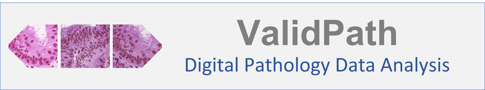
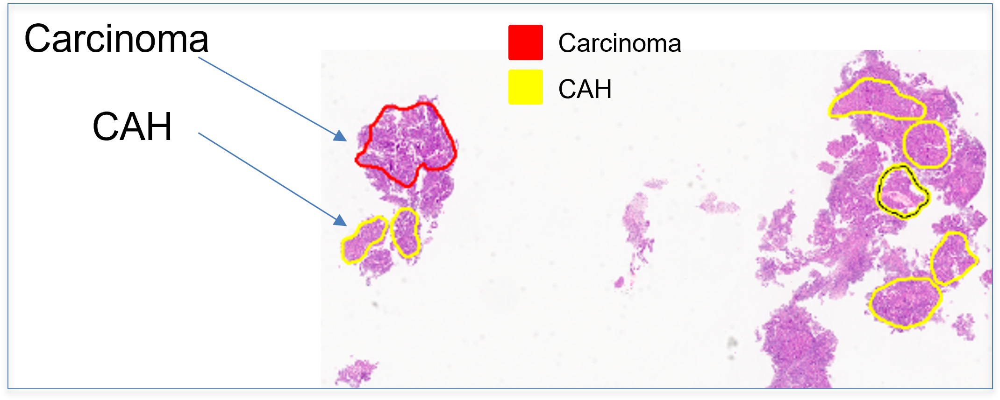

<p align="center">
  <h1 align="center">ValidPath: Whole Slide Image Processing and Machine Learning Performance Assessment Tool</h1>
</p>

<p align="center">
  
</p>

<h1 align="center"> </h1>
<p align="center">
  <h1 align="center">DIDSR Digital Pathology Toolbox</h1>
</p>
<p align="center">
  
</p>


## Getting Started

### General Information
**`ValidPath`** is a python-based package for developers and scientists who are interested in digital pathology. The main goal of developing this tool is to help stakeholders, graduate students, and pathologists to speed up their projects.  For more information please contact: **[seyed.kahaki@fda.hhs.gov](mailto:seyed.kahaki@fda.hhs.gov)**.

We are continuously working on this toolbox, and we welcome any contributions.

### Modules
There are several modules in this package including
1.	WSI Handler: Includes functions and classes for general WSI analysis such as reading whole slide images, extract sub region, and visualize thumbnail.
2.	Annotation Extraction: Includes several functions for extracting annotated ROIs.
3.	Patch Extraction: Assists pathologists and developers in extracting image patches from a whole slide image's region of interest.
4.	Annotation File Generator: Maps ROIs back into the image scope visualizer for the pathologist validation process
5.	Performance Assessment: Includes different modules for assessing the performance of ML models.

### Information for Developers
Code Documentation: [Link](https://didsr.github.io/ValidPath/index.html)
Please refer to the code documentation and email  **[seyed.kahaki@fda.hhs.gov](mailto:seyed.kahaki@fda.hhs.gov)** if you have any questions.


### Testing Examples
1. [WSI Reader: Read Whole slide Image, Extract WSI Regions](https://github.com/didsr/ValidPath/blob/main/01_read_wsi.ipynb)
2. [Extract Annotations: Extract annotations and masks from Whole Slide Images](https://github.com/didsr/ValidPath/blob/main/02_annotation_extraction.ipynb)
3. [Patch Extraction: Extract patch images from annotated regions](https://github.com/didsr/ValidPath/blob/main/03_patch_extraction.ipynb)
4. [Annotation Generator: Generate Aperio ImageScope Annotation file](https://github.com/didsr/ValidPath/blob/main/4_annotation_generator.ipynb)
5. [Performance Assessmet: including different methods for assessing the performance of ML models](https://github.com/didsr/ValidPath/blob/main/05_performance_assessment.ipynb)

## Installation
This section will help you to install the packages needed for ValidPath.

### Install Python package

If you wish to use our python package, perhaps without developing them further, run the command pip install ValidPath or pip install --ignore-installed --upgrade ValidPath to upgrade from an existing installation (This will be enabled when the first version is ready and submitted to pypi).

Detailed installation instructions can be found in the [documentation]([Link to Installation Guide dependencies](https://didsr.github.io/ValidPath/installation.html)
To understand better how the programs work, study the jupyter notebooks referred to under the heading [**Examples Taster**](https://github.com/didsr/ValidPath/blob/main/README.md#testing-examples).

### Pre-requirements

In order to use ValidPath, you need to install some additional python packages. It is recommended to install the same version specified in this section (and in the requirement.txt). ValidPath was tested on the following environment: 
- Linux System (Tested on Ubuntu 18.04.3 LTS)
- Python 3.8
  
To install a python package with specific version of a package using pip, you can use the syntax “pip install package==version” in the command line. For example in ValidPath we are using lxml which is one of the fastest and feature-rich libraries for processing XML and HTML in Python. To install lxml version 4.9.1, run the following command:
```sh
pip install lxml==4.9.1
```
Please follow the same procedure to install these python packages:
```sh
•	lxml==4.9.1
•	opencv-python==4.8.1.78
•	openslide-python==1.1.2
•	scikit-image==0.18.1
•	Shapely==1.7.1
•	sharepy==2.0.0
•	matplotlib==3.6.2 
•	Pillow==9.3.0
•	tifffile==2022.10.10
•	mpmath==1.2.1
•	random
•	glob
•	pandas
•	numpy
```
For the full list of the requirements, please see the requirement.txt file in the project root directory 

  
In order to check the current package version installed on you system, you can use “pip freeze” or “.___version___” as follows:
```sh
  pip freeze | findstr lxml
```
or 
```sh
  import lxml
  print(lxml.__version__)
```


### Prepare for development (this is optional)

Prepare a computer as a convenient platform for further development of the Python package ValidPath and related programs as follows.
1.	Install the dependencies based on this guide (Link to Installation Guide dependencies)
2.	Open a terminal window
```sh
    $ cd ValidPath ROOT DIRECTORY
```
4.	Download a complete copy of the ** ValidPath **.
```sh
  $ git clone https://github.com/didsr/ValidPath/
```
5.	Change directory to ValidPath
```sh
  $ cd ValidPath
```
6.	Create virtual environment for ** ValidPath** using
```sh
  $ conda env create -f requirements.dev.conda.yml
  $ conda activate ValidPath-dev
```
or
```sh
  $ conda create -n ValidPath-dev python=3.8 
  $ conda activate ValidPath-dev
  $ pip install -r requirements.txt
```
7.	To use the packages installed in the environment, run the command:
```sh
$ conda activate ValidPath-dev
```

<!--  
### Cite this repository

If you find that ValidPath is useful or if you use it in your project, please consider citing the code:

```
Seyed Kahaki, Arian Arab, Weijie Chen. (2024) ValidPath [Source Code] https://github.com/didsr/ValidPath
```

And this pape:
```
@article{10.1117/1.JMI.11.1.017502,
  author = {Seyed Mostafa M. Kahaki and Ian S. Hagemann and Kenny H. Cha and Christopher J. Trindade and Nicholas A. Petrick and Nicolas Kostelecky and Lindsay E. Borden and Doaa Atwi and Kar-Ming Fung and Weijie Chen},
  title = {{End-to-end deep learning method for predicting hormonal treatment response in women with atypical endometrial hyperplasia or endometrial cancer}},
  volume = {11},
  journal = {Journal of Medical Imaging},
  number = {1},
  publisher = {SPIE},
  pages = {017502},
  keywords = {mixed supervised learning, deep learning, hormonal treatment, atypical endometrial hyperplasia, Data modeling, Deep learning, Education and training, Feature extraction, Performance modeling, Machine learning, Radiomics, RGB color model, Tumor growth modeling, Statistical modeling},
  year = {2024},
  doi = {10.1117/1.JMI.11.1.017502},
  URL = {https://doi.org/10.1117/1.JMI.11.1.017502}
}
```
-->
### Auxiliary Files

Example of input data can be found here: [Link](https://github.com/didsr/ValidPath/tree/main/data).

### Contact
For any questions/suggestions/collaborations, please contact Seyed Kahaki either via this GitHub repo or via email (seyed.kahaki@fda.hhs.gov).

### Acknowledgment 
This project was supported in part by an appointment to the ORISE Research Participation Program at the Center for Devices and Radiological Health, U.S. Food and Drug Administration, administered by the Oak Ridge Institute for Science and Education through an interagency agreement between the U.S. Department of Energy and FDA/CDRH.

### Disclaimer
#### About the Catalog of Regulatory Science Tools
The enclosed tool is part of the [Catalog of Regulatory Science Tools](https://cdrh-rst.fda.gov/), which provides a peer-reviewed resource for stakeholders to use where standards and qualified Medical Device Development Tools (MDDTs) do not yet exist. These tools do not replace FDA-recognized standards or MDDTs. This catalog collates a variety of regulatory science tools that the FDA’s Center for Devices and Radiological Health’s (CDRH) Office of Science and Engineering Labs (OSEL) developed. These tools use the most innovative science to support medical device development and patient access to safe and effective medical devices. If you are considering using a tool from this catalog in your marketing submissions, note that these tools have not been qualified as [Medical Device Development Tools](https://www.fda.gov/medical-devices/medical-device-development-tools-mddt) and the FDA has not evaluated the suitability of these tools within any specific context of use. You may [request feedback or meetings for medical device submissions](https://www.fda.gov/regulatory-information/search-fda-guidance-documents/requests-feedback-and-meetings-medical-device-submissions-q-submission-program) as part of the Q-Submission Program.
For more information about the Catalog of Regulatory Science Tools, email [RST_CDRH@fda.hhs.gov](mailto:RST_CDRH@fda.hhs.gov).

### Tool Reference
•	RST Reference Number: RST24CV11.01

•	Date of Publication: 06/20/2024

•	Recommended Citation: U.S. Food and Drug Administration. (2024). ValidPath: Whole Slide Image Processing and Machine Learning Performance Assessment Tool (RST24CV11.01). [Link](https://cdrh-rst.fda.gov/validpath-whole-slide-image-processing-and-machine-learning-performance-assessment-tool)


