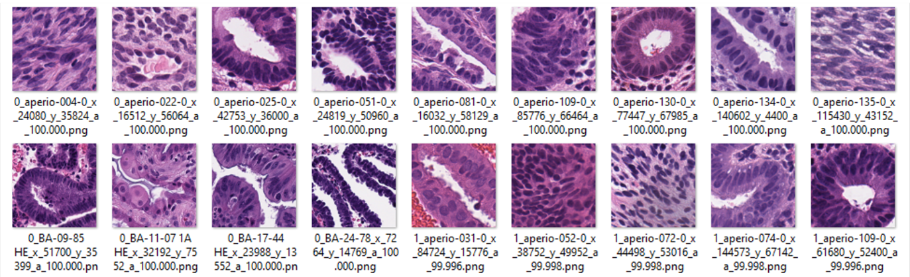
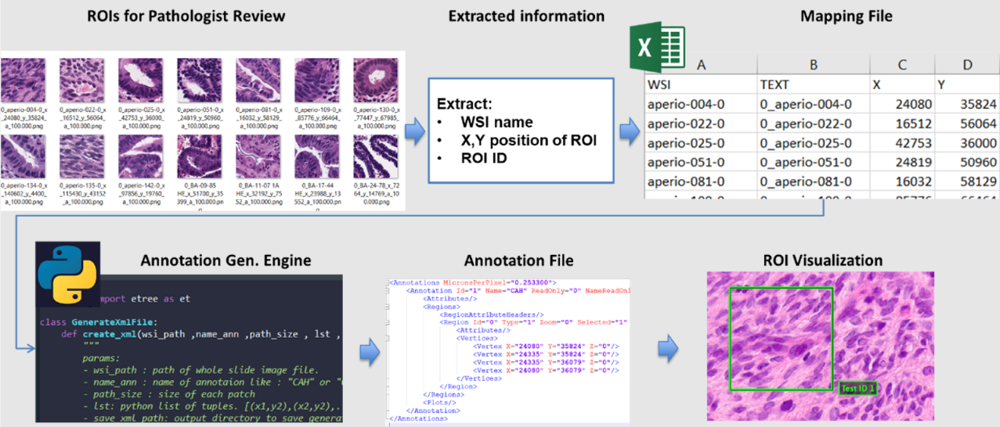
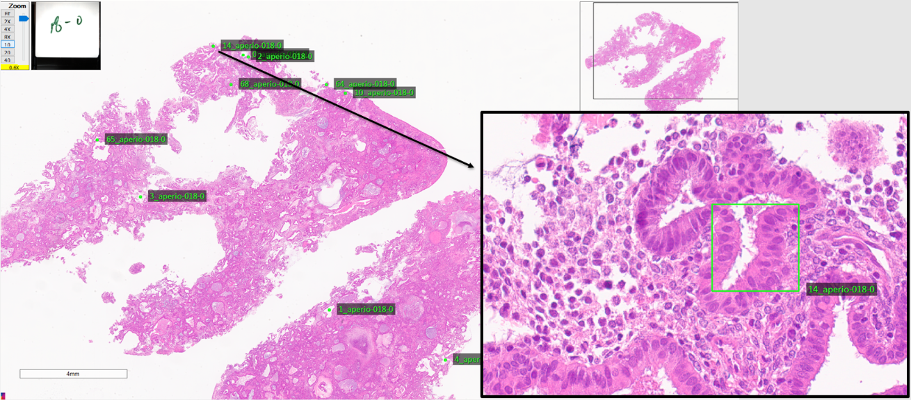

Annotation File Generator 
==================

assessment.annotation module
--------------------------------

.. automodule:: assessment.annotation
   :members:
   :undoc-members:
   :show-inheritance:

About this module
--------------------------------

This demonstration guides you through the process of using ValidPath to generate annotation file for Aperio Image Scope application. This feature enabled using methods included in the ROI class. his module enables generating visualizing the location of the image patches on the WSI file (in Image Scope application). The input to this process is a directory of image patches which the location of each image patch is coded into the file name as <annotation ID>_<WSI File Name>_x_<x coordinate of the image patch>_y_<y coordinate of the image patch>.png

The ROI generating module has two steps including Mapping file generation, and XML file (ROI file) generation. The pipeline of this process summarized in the image below.  
   

Loading Required Packages   
--------------------------------
This step involves importing various Python modules that are needed for our analysis.

.. code-block:: console

	from assessment.ROI import ROI_Generator

Generating the Map File
--------------------------------
As mentioned earlier, the first step of the annotation generation file is to generate the map file which is a csv file. Please make sure that you imported the ROI_Generator class using "from assessment.ROI import ROI_Generator". To generate the map file, you can call the generate_map_file method of the ROI_Generator class

You can run the following code to generate the map filename:

.. code-block:: console

	input_DIR = 'C:/DATA/6_ML_Patches/ML_Patches/HighRanked/'
	output_DIR = 'C:/DATA/6_ML_Patches/'
	file_Name = 'coordinatesTEST.csv'
	ROI_Generator = ROI_Generator()
	ROI_Generator.generate_map_file(input_DIR,output_DIR,file_Name)

Generating ROIs
--------------------------------
Having the ROI mapping file, we can now generate the XML file which are readable with Aperio image scope application. In order to generate the annotation files, we can use the create_xml method of the ROI_Generator class

You can run the following code to generate the XML files containing annotations:

.. code-block:: console

	input_DIR = 'C:/DATA/6_ML_Patches/'
	file_Name = 'coordinatesTEST.csv'
	path_size= 255
	ROI_output_DIR =r'C:/DATA/temp/ForPathologistReview_TEST/'
	tag_name = 'HighRanked'
	ROI_Generator = ROI_Generator()
	ROI_Generator.create_xml(input_DIR,file_Name,path_size ,ROI_output_DIR,tag_name)

After generating the XML file, copy them into the whole slide image folder and open the WSI to visualize the WSI and the ROI regions. The result should look like this:

   
