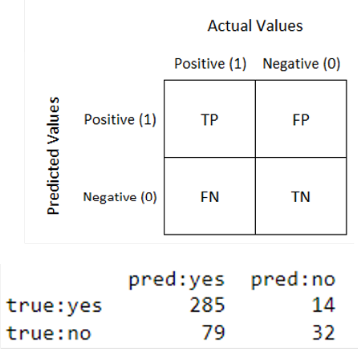
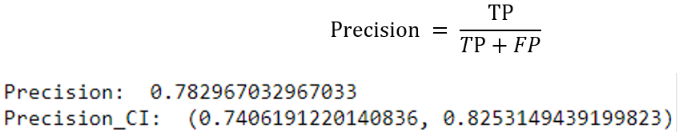
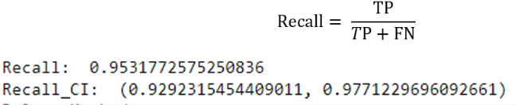
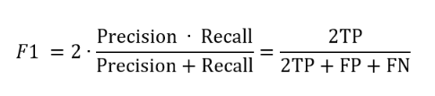
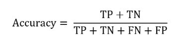
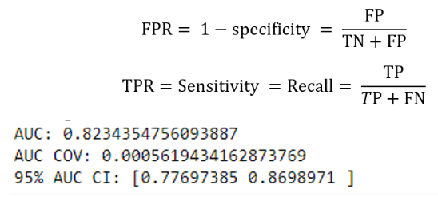
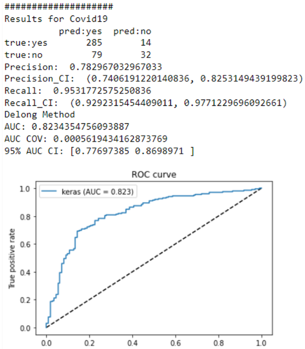

ML Assessment
==================

assessment.uncertainty module
-----------------------------------

.. automodule:: assessment.uncertainty
   :members:
   :undoc-members:
   :show-inheritance:

About this module
--------------------------------

This demonstration guides you through the process of using ValidPath to for performance evaluation of ML models. This is enabled using the get_report method of the UncertaintyAnalysis class in the ValidPath. The input to this method are the probability results of the ML model as well as the truth values. The output of this method include:

	Confusion Matrix
 

 
	Precision and its confidence interval.

	Recall/Sensitivity and its confidence interval.

 
	F1 Score and its confidence interval.

	Accuracy

	AUC, and its confidence interval
	

 
For the confidence interval calculation, we first define J=  TP/(TP+FN+FP) , and computed its 95% CI [JL, JU] based on the binomial distribution. Then because F1=  2J/(1+J) , the 95% CI of F1 is [2JL/(1+JL), 2JU/(1+JU)].

Loading Required Packages
--------------------------------
This step involves importing various Python modules that are needed for our analysis.

.. code-block:: console

	import numpy as np
	import pandas as pd
	from assessment.uncertainty import Uncertainty_Analysis
	UncertaintyAnalysis = Uncertainty_Analysis()

Generate Results
--------------------------------
Having the output of the binary classification results, we can now generate the performance results. In order to generate the annotation files, we can use the get_report method of the UncertaintyAnalysis class. 

.. code-block:: console

	UncertaintyAnalysis. get_report(y_pred , y_truth) → Array
	Receive the classification probabilities and the truth and generate the results.
	Parameters: 
		y_pred (arr) – prediction results (probabilities)
		y_truth (arr) – truth
	Returns:
		Array – the classification report

You can run the following code to generate classification report:

.. code-block:: console

	import numpy as np
	import pandas as pd
	from assessment.uncertainty import Uncertainty_Analysis
	UncertaintyAnalysis = Uncertainty_Analysis()
	xls_file = "C:/Results/ResultsExample.xlsx"
	UncertaintyAnalysis.perform_Bootstrap= True
	UncertaintyAnalysis.plot_roc= True       
	UncertaintyAnalysis.perform_Delong= True
	UncertaintyAnalysis.tag = “TEST”
	#loading file tnto dataframe
	df = pd.read_excel(xls_file)
	#define two list to save values
	y_pred=[]
	y_truth= []
	#extraction columns values 
	for i in df.values:
		y_truth.append(i[0])
		y_pred.append(i[1])
	#convert list to ndarray
	y_pred = np.array(y_pred)
	y_truth = np.array(y_truth)
	Results = UncertaintyAnalysis.get_report(y_pred , y_truth)
	
After running the code and provide the input data, you will see the performance report like the following:

	