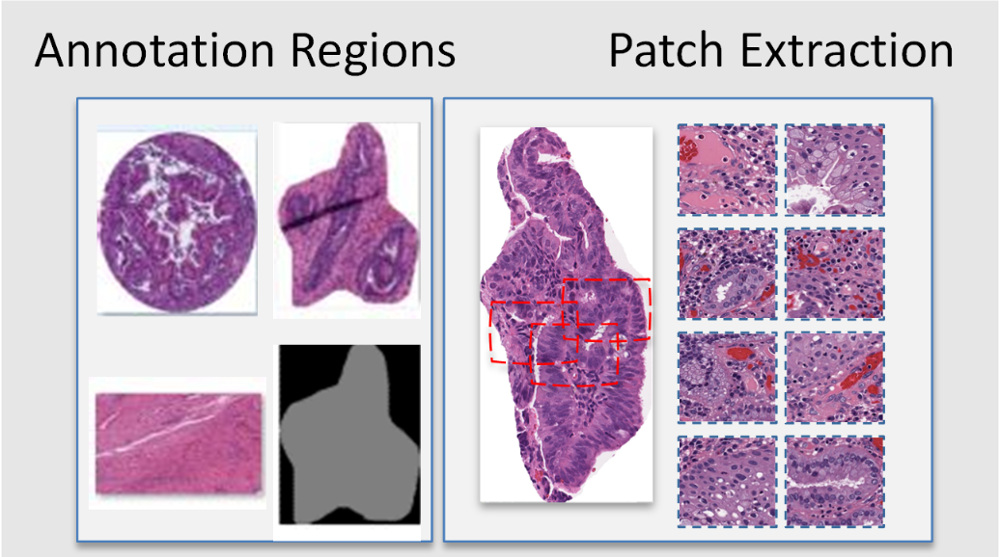

Patch Extraction
===========

WSI.patch module
-----------------------

.. automodule:: WSI.patch
   :members:
   :undoc-members:
   :show-inheritance:

About this module
--------------------------------------------------------

This demonstration guides you through the process of using ValidPath to extract patches within annotations. This feature enabled using the patch_extraction method.

   
   
   
Loading Required Packages
--------------------------------------------------------

This step involves importing various Python modules that are needed for our analysis.

.. code-block:: console

	import os
	from WSI.readwsi import WSIReader
	from WSI.patch import WSIpatch_extractor
	from WSI.patch import PatchExtractor
	import matplotlib.pyplot as plt

Patch Extraction from Annotated Area
--------------------------------------------------------
In this section, we show you how to extract image patches from the annotations which are already extracted. We do this by using ValidPath's PatchExtractor class. This step should be run after extracting the annotated area of the WSI. If you haven't extracted the annotations, in order to extract the image patches. please follow the steps in this Notebook github.com/DIDSR/wsi_processing_toolbox/02_annotation_extraction.ipynb. After extracting the annotations, you can call the gen_patch method from the annotation.patch_extractor class to extract image patches. Please make sure that you imported the PatchExtractor class using "from annotation.patch_extractor import PatchExtractor". Please run the following code to generate image patches from the annotated area.

let’s call the method and extract annotations. This can be done using the following code (please modify the variables as needed):

.. code-block:: console

	PatchExtractor = PatchExtractor()
	INPUTDIR = 'C:/DATA/0_Washu-Aperio/input_output/'
	PatchSize = (255,255)
	Number_of_Patches = 10
	OUTPUTDIR = 'C:/DATA/0_Washu-Aperio/out_dir/'
	intensity_check = True
	intensity_threshold = 250
	PatchExtractor.gen_patch(INPUTDIR,PatchSize,Number_of_Patches,intensity_check,intensity_threshold,OUTPUTDIR)

Extracted annotations are based on defined inputs. For example, you can specify the number of patches you would like to extract from each annotation. You may also set 'intensity_check' to 'True' if you would like to filter the generated image patches. When 'intensity_check' is set to 'True,' only patches from annotated regions with at least three corners having high intensity (e.g., intensity higher than 240) will be extracted.

Note: the size of the annotation should be at least two times larger than the patch size.

Patch Extraction from the entire WSI
--------------------------------------------------------	
In this section, we will demonstrate how to load a WSI and extract image patches from the entire WSI. This step can be done independently without the need to extract annotations since we will work directly with WSI. Please make sure that you imported the WSIpatch_extractor class using " from WSI.readwsi import WSIpatch_extractor". We extract image patches by using patch_extraction method of the WSIpatch_extractor class:

Since this method extract image patches from the entire WSI (not annotated regions), we need to call the wsi_reader to read a WSI. Therefore, we need to load a WSI and create the WSI object. This is enabled using the wsi_reader method in the ReadWsi package. For this, we will set up a directory which contains our WSI files, we will create a list in Python and append WSI names in this list and load the WSI using the wsi_reader using an index.

.. code-block:: console

	dir_file = “C:\DATA\0_Washu-Aperio”
	   
	 file_name = “aperio-002-0.svs”
	path = dir_file + "\\" + file_name
	 if os.path.exists(path):
			wsi_obj =WSI.wsi_reader(path)
			break
		else:
			print("File path error!" )

	print(" Done...")

After reading the WSI using the wsi_reader, we have an object which has the loaded WSI. To validate if the object is loaded correctly, we print the object and also print the available pyramid levels of the WSI using the “.level_dimensions” method.

.. code-block:: console

	print(wsi_obj)
	print(wsi_obj.level_dimensions)

To see a thumbnail of the WSI, we use the get_thumbnail method of wsi_reader. We load the thumbnail as follows:

.. code-block:: console

	for example: size_ = (600,300)
	tile= wsi_obj.get_thumbnail(size=size_)
	plt.imshow(tile)
	plt.title("WSI thumbnail")

Now we can call the patch_extraction method of the WSIpatch_extractor class to extract image patches. You can use the following code to call this methos.

.. code-block:: console

	patchsize = 256
	output_directory = "C:/DATA/0_Washu-Aperio/out_dir/"
	random= False
	visualize = True
	intensity_check = False
	num_patches = 10 # set to -1 to extract all patches
	intensity_threshold = 250
	std_threshold = 15
	WSIpatch_extractor.patch_extraction(wsi_obj,patchsize,output_directory,random,visualize,intensity_check,intensity_threshold,std_threshold,num_patches)

	